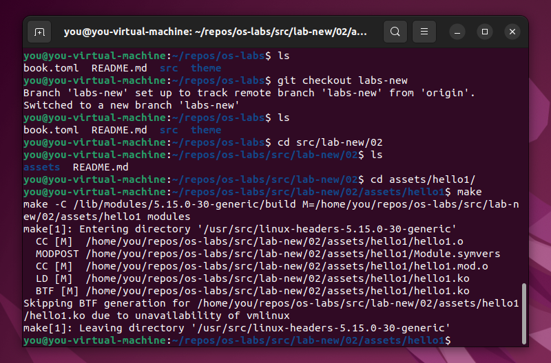
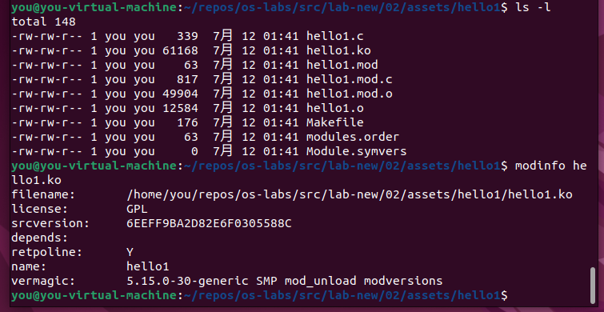
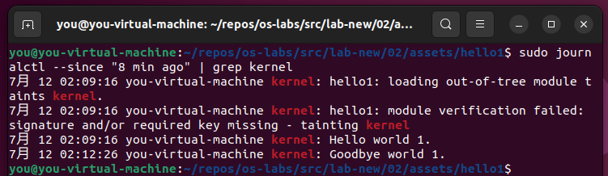
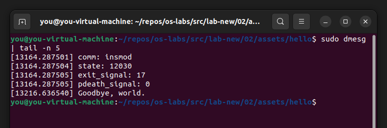

# 实验二: 添加内核模块

## 实验目的

1. 掌握内核模块基本编程技术
2. 向内核中添加一个内核模块, 打印进程控制块信息, 编译模块
3. 加载、卸载模块

> 备注: 此模块要求返回当前运行进程 (CURRENT) 或者始祖进程 (init_task) 的进程控制块中的至少 30 项信息, 用中文标记含义. 此条备注不放入实验报告.

## 实验原理

内核模块 (kernel module) 是可以根据需要而被加载到内核中, 或从内核中卸载的代码. 这样便可以在运行过程中扩展内核的功能, 而无需重新引导系统.

举个例子, 设备驱动就是一种模块, 它让内核能够访问到连接到系统的硬件.

如果没有内核模块, 则不得不构建一个宏大的内核, 所有的新功能也都只能直接添加到内核镜像中.
除了内核将会非常巨大之外, 另一件麻烦事就是, 当每次想要添加新功能时, 都需要重新构建内核并重新引导系统.


1. 模块是 Linux 精心设计的一种机制, 可以用来动态增加内核的功能, 模块在内核空间运行. 
2. Linux模块可以在内核启动过程中加载, 这称为静态加载. 也可以在内核运行的过程中随时加载, 这称为动态加载. 
3. Linux中的大多数设备驱动程序或文件系统都被编译成模块, 因为它们数目繁多, 体积庞大, 不适合直接编译在内核中. 而通过模块机制, 在需要使用它们的时候, 在临时加载, 是最合适不过的. 

### Linux 内核模块软件包

在 Linux 发行版在一个软件包中提供了 `modprobe`, `insmod` 和 `depmod` 命令.

可以通过以下命令, 通过包管理器, 确保安装了所需的软件包 (构建工具和 `kmod`):

Ubuntu/Debian:

```
sudo apt-get install build-essential kmod
```

Arch Linux:

```
sudo pacman -S gcc kmod
```

### 查看内核模块

使用 `lsmod` 命令查看内核当前已经加载的模块.

```
sudo lsmod
```

内核模块都存储在 `/proc/modules` 文件中, 可以通过以下命令查看文件内容.

```
sudo cat /proc/modules
```

### Linux 内核头文件

在开始构建之前, 需要确保安装了所使用内核对应的头文件.

### 最简的内核模块示例

首先建立一个测试目录, 如 `~/dev/kernel/hello1/`.

并在目录下新建一个 C 程序源文件, 如 [`hello-1.c`](./assets/hello/hello-1.c).

其中至少包含两个函数:

- `init_module()`: 模块加载的时候调用;
- `cleanup_module()`: 模块被卸载前调用.

```cpp
// hello1.c

{{#include assets/hello/hello-1.c}}
```

之后建立一个 `Makefile` 用于构建.

Linux 内核使用 `kbuild` 构建系统, `kbuild` 构建系统也可用于编译自定义的内核模块.

编译过程首先会到内核源码目录下, 读取顶层的 `Makefile` 文件, 然后再编译模块源码, 生成的内核模块后缀为 `.ko`.

Makefile 提供的 `obj-m` 表示对象文件 (object files) 编译成可加载的内核模块.

`hello-1.c` 的 `Makefile` 文件 `obj-m += hello-1.o` 表明有一个模块要从目标文件 `hello-1.o` 建立, `kbuild` 从该目标文件建立内核模块 `hello-1.ko`.

```
{{#include assets/hello/Makefile}}
```

> `Makefile` 中的缩进为 Tab 而非空格.

- `PWD := $(CURDIR)` 获得当前目录路径并存储在变量中;
- `-C` 是表示进入指定目录下, 执行对应目录下的 Makefile, 目的是为了找到并使用内核的顶层 Makefile;
- `M` 不是 `make` 命令的选项, 而是 Makefile 中使用的变量, 目的是为了使 Makefile 在试图建立模块目标前, 回到模块源码目录;
- `modules` 是 Makefile 中的目标;
- `uname` 命令用于显示当前操作系统名称. 传递 `-r` 选项则显示操作系统的发行版号
- `obj-m` 表示把 `hello.o` 文件作为 "模块" 进行编译, 不会编译到内核, 但是会生成一个独立的 "`hello.ko`" 文件;
- `obj-y` 表示把 `hello.o` 文件编译进内核.

之后运行 `make` 命令进行构建.



若不出问题, 则可以接下来可以在目录下看到编译得到的模块文件 `hello1.ko`. 可以用如下命令查看模块的信息:

```
modinfo hello1.ko
```




### 加载模块

超级用户可以通过 `insmod` 和 `rmmod` 命令显式地 (手动) 将模块载入内核或从内核中将它卸载.

尝试载入上一步构建的 `hello-1` 模块:

```
sudo insmod hello-1.ko
```

之后则可以通过 `lsmod` 确认已经载入内核模块:

```
sudo lsmod | grep 'hello'
```

可以通过 `rmmod` 命令卸载模块:

```
sudo rmmod hello_1
```

> 模块名中的连字符 (dash) 会被替换为下划线. 如 `hello-1` 对应变换为 `hello_1`.

可以在日志中查看如上发生的事情 (也可以使用 `dmesg` 命令).

```
sudo journalctl --since "1 hour ago" | grep kernel
```



### 注意事项

一般来说, `init_module()` 函数要么用来向内核中注册某个服务的 handler, 要么替换掉某个内核函数的代码 (通常是做一些额外的事情, 然后再调用原来的函数). 而 `cleanup_module()` 函数则应该撤销 `init_module()` 所做的任何修改, 以保证模块可以被安全地卸载.

每个内核模块也都应该包含 `<linux/module.h>` 头文件. 引入 `<linux/kernel.h>` 只是为了 `pr_alert()` 日志等级的宏展开.

1. 关于代码风格: 内核编程的习惯, 是使用 Tab 缩进, 而不是空格.
2. 引入用于输出的宏: 最初的时候, 有 `printk` 用于输出信息, 通常跟随一个优先级, 如 `KERN_INFO` 或者 `KERN_DEBUG`. 后来则可以使用宏, 以一种简化的形式表达, 如 `pr_info` 和 `pr_debug`.
3. 关于编译: 内核模块的编译过程不同于运行在用户空间的一般程序. 早期的内核版本需要编程者关心大量的设定, 通常在 Makefile 文件中存储. 虽然以分层级的形式进行管理, 但是仍会有重复的设定项随着时间累积在子层级的 Makefile 文件中, 变得庞大而难以维护. 幸运的是, 一种叫做 `kbuild` 的新方式可以处理这些事情, 并且可加载的外部模块的构建过程完全被集成在了基础的内核构建机制中. 关于如何构建自定义模块的详情, 可以参考 [Documentation/kbuild/modules.rst][doc-kbuild-modules-src] ([在线阅读][doc-kbuild-modules]).

关于内核模块使用的 Makefile 的详细信息, 可以参考 [Documentation/kbuild/makefiles.rst][doc-kbuild-makefiles-src] ([在线阅读][doc-kbuild-makefiles])

[doc-kbuild-modules-src]: https://git.kernel.org/pub/scm/linux/kernel/git/stable/linux.git/tree/Documentation/kbuild/modules.rst
[doc-kbuild-modules]: https://www.kernel.org/doc/html/latest/kbuild/modules.html
[doc-kbuild-makefiles-src]: https://git.kernel.org/pub/scm/linux/kernel/git/stable/linux.git/tree/Documentation/kbuild/makefiles.rst
[doc-kbuild-makefiles]: https://www.kernel.org/doc/html/latest/kbuild/makefiles.html

在早期的内核版本中, 只能使用 `init_module` 和 `cleanup_moudle` 函数, 但现如今通过使用 `module_init` 和 `module_exit` 宏定义则可以使用任意的名字. 这些宏定义在 [linux/module.h][linux-module-h] 中, 使用时需要在源代码中包含. 需要注意的是, 在调用宏之前, 函数必须被先定义, 否则将在编译时产生错误.

[linux-module-h]: https://git.kernel.org/pub/scm/linux/kernel/git/stable/linux.git/tree/include/linux/module.h


```cpp
// hello-2.c

{{#include ./assets/hello/hello-2.c}}
```

## 实验过程

### 向内核中添加一个内核模块, 打印进程控制块信息, 编译模块

[showPCB.c](./assets/showPCB/showPCB.c)

```cpp
{{#include ./assets/showPCB/showPCB.c}}
```

[Makefile](./assets/showPCB/Makefile)

```
{{#include ./assets/showPCB/Makefile}}
```

### 加载, 卸载模块



### 返回当前运行进程 (current) 或始祖进程 (init_task) 的进程控制块中的至少 30 项信息


## 实验心得

 
## 参考资料

[sysprog21/lkmpg: The Linux Kernel Module Programming Guide](https://github.com/sysprog21/lkmpg)
([在线阅读](https://sysprog21.github.io/lkmpg/))
