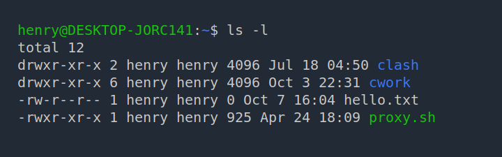
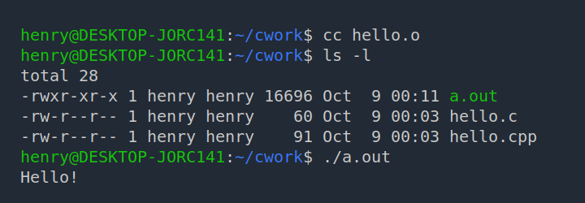

# 实验一：Linux的初步认识

实验课时：3学时

## 一、实验目的

1. 了解 Linux 发行版（Ubuntu）的安装过程
2. 掌握基本的 Shell 命令（bash）
3. 了解 vi 编辑器的使用
4. 设计一个 Shell 程序
5. 设计 C 程序，在 Shell 下使用 gcc 编译器编译 C 程序
6. 设计一个 Makefile 文件

## 二、实验原理

### 1. 安装过程

在主机上安装并使用虚拟机软件（如 VMware Workstation、Oracle VirtualBox 等），建立一个虚拟机。

针对 Ubuntu 的配置，可以选择 2 × CPU + 2 GB RAM 以及 20 GB 以上的磁盘空间，或遵循虚拟机软件的默认配置。

接着需要获取安装介质。可以在官方网站获取 Ubuntu 的安装镜像。

将安装介质装载在虚拟机（客户机）上，启动虚拟机。由于虚拟机“物理驱动器”上默认无操作系统，便会从“光盘驱动器”启动。“光盘驱动器”中装载的即为 Ubuntu 的安装镜像。

之后进行简单的配置。在设置用户名时，可以选择简单的用户名和密码组合，以便输入。

首次进入系统后，可以将软件包源配置为易于访问的镜像源。软件包提供方即为软件源，用户可以通过包管理器获得软件源下所提供的软件包。包管理器会在本地存取一份软件源下可用的软件包列表，即软件源缓存。切换软件源后、每次安装或更新软件包前，最好应该执行一次刷新软件源的操作。

可以在 Ubuntu 桌面应用列表中找到“Software & Updates”应用，更改其中的软件源。Ubuntu 官方下载的镜像安装的系统中包含诸多已有的镜像源。比如，我们可以选择“China”下的“<https://mirrors.ustc.edu.cn/>”。确认选择后，点击 Close 关闭应用，会提示用户进行刷新软件包缓存。

用户也可按 `Ctrl` + `Alt` + `T` 组合键，或在应用列表中打开“终端（Terminal）”，在 Shell 中以超级用户（Super User）权限执行 `apt update` 命令刷新软件源缓存。

在首次使用前，还建议执行一次更新操作，即 `apt upgrade`，命令如下：

```bash
sudo apt upgrade
```

（建议）用户默认以普通用户身份登入，使用 `sudo` 来执行需要提权的操作。更新完成后，可以重启一次客户机中的系统。

接下来安装一些其他开发所需软件包，如 C/C++ 编译器、git、CMake 等。可以通过安装 `build-essential` 伪包来安装构建所需的诸软件包。

```bash
sudo apt install build-essential git cmake
```

### 2. 常见 bash 命令

默认情况下，打开终端，其中运行的就是 Shell 程序。Shell 程序可以解析用户的输入，从而执行用户的指令，比如对计算机（系统）进行操作、运行其他程序。

Ubuntu 默认的 Shell 程序为 bash，有如下常见的命令。

- cd：改变当前目录命令                   
- pwd：显示目前所在目录的指令
- ls：列出指定目录的内容
- mkdir：建立目录
- cp：文件复制命令
- rm：删除文件或目录
- mv：文件移动、重命名          
- chmod：变更档案属性                   
- df：查看系统的文件系统的空间使用情况
- du：查看具体某个文件和目录的磁盘空间的占用情况
- clear：清除终端中的输出
- whoami：查看当前登录用户名

用户可以使用“命令行选项”来控制命令的执行，即，向其传递（pass）命令行参数。

如，可以为 `ls` 命令添加 `-l` 参数，使其以列表形式输出目录下的内容；亦可以添加 `-a` 参数，使其输出目录下所有文件及子目录（包含隐藏文件和目录）。

有时候，我们可以将这种单字母的指令组合在一起，即，`ls -l -a` 等价于 `ls -la`。

用户还可自定义别名（alias），来简化命令的输入。比如，Ubuntu 默认启用了 `la` 和 `ll` 这两个别名，分别对应着 `ls -a` 和 `ls -la`。

有关**管道**、**输出重定向**、**PATH 环境变量**、**任务控制**等详情，另请阅读：

- [命令行与 Shell 程序 - 程序员入门指南](https://tsagaanbar.gitee.io/newly-programmer-abc/begin-programming/cli/cli-and-shell.html)
- [一些常用 Shell 命令 - 程序员入门指南](https://tsagaanbar.gitee.io/newly-programmer-abc/begin-programming/cli/common-commands.html)
- [一些常用命令行工具 - 程序员入门指南](https://tsagaanbar.gitee.io/newly-programmer-abc/begin-programming/cli/common-cli-tools.html)

`ls -l` 命令输出类似如下：

```console
$ ls -l
total 12
drwxr-xr-x 2 henry henry 4096 Jul 18 04:50 clash
drwxr-xr-x 6 henry henry 4096 Oct  3 22:31 cwork
-rw-r--r-- 1 henry henry    0 Oct  7 16:04 hello.txt
-rwxr-xr-x 1 henry henry  925 Apr 24 18:09 proxy.sh
```



可以看到，每行行首有诸如 `drwxr-xr-x` 这样的字符串，第一个字符表示文件类型，如 `d` 表示文件为目录、`-` 表示文件为普通文件、`l` 表示文件为链接。剩余字符三个一组，分别表示所有者权限、所有者同组用户权限，以及其他用户权限。

可以使用 `chmod` 命令修改文件权限。


### 3. vi 编辑器

基本使用：

- 使用 `vi` 和某文件名以打开某文件进行编辑，如 `vi some.txt`；若文件不存在，则将会被创建；
- 甫一进入程序时为命令模式，按 `i` 键（键入小写字母 `i`）进入插入模式，之后的输入将会存入缓存；
- 按 <kbd>ESC</kbd> 退出插入模式，回到命令模式；
- 输入以下命令：
    - `:wq` 将改动写入文件并退出；
    - `:q` 退出程序；但如果有修改，则需要使用 `:q!` 来放弃修改。

在命令模式下，可以：

- 按 `h`、`l` 左右移动光标，按 `j`、`k` 上下移动光标
- 按 `x` 可以删除字符
- 按 `dd` 可以删除当前所在的行

要进入插入模式，除了可以按 `i` 键，还有更多的选择：

|  键  |                       功能                       |
| :--: | :----------------------------------------------: |
| `i`  |              在**光标左侧**输入正文              |
| `a`  |              在**光标右侧**输入正文              |
| `I`  |          在光标所在行的**行首**输入正文          |
| `A`  |          在光标所在行的**行尾**输入正文          |
| `o`  | 在光标所在行的下一行增添新行，光标位于新行的行首 |
| `O`  | 在光标所在行的上一行增添新行，光标位于新行的行首 |


### 4. 编写简单的 Shell 程序

事实上，在有图形界面时，可以不必在命令行界面下编辑文本。Ubuntu 自带的 GNOME 桌面提供有 `gedit` 工具，使用方法类似，即在 Shell 中执行 `gedit <filename>`，即可调出图形化的编辑界面。

用户亦可安装自己喜欢的编辑器，如 [Visual Studio Code](https://code.visualstudio.com)。

[hello.sh](./hello.sh)

```bash
{{#include hello.sh}}
```

文件最开始的 `#!/bin/bash` 称为 Shebang。在计算领域中，Shebang（也称为 Hashbang）是一个由井号和叹号构成的字符序列（`#!`），其出现在文本文件的第一行的前两个字符。在文件中存在 Shebang 的情况下，类 Unix 操作系统的程序加载器会分析 Shebang 后的内容，将这些内容作为解释器指令，并调用该指令，并将载有 Shebang 的文件路径作为该解释器的参数。例如，在终端中输入一个 Shebang 内容为 `#!/bin/bash` 的文件的路径 `path/to/script`，则相当于使用 `/bin/bash` 处的可执行程序解释运行 `path/to/script` 处的脚本，即 `/bin/bash path/to/script` 命令。

也就是说，得益于这种机制，脚本文件也可以像一个可执行程序一样来使用：

```console
$ ./hello.sh
```

`./hello.sh` 是 `hello.sh` 这个脚本文件的路径，即当前目录下的 `hello.sh`。不过，在这之前，还需要为脚本添加可执行的权限：

```console
$ chmod +x ./hello.sh
```

> 有些时候，下载的可执行文件缺失了信息，也需要重新为其添加可执行权限。

[read-dir.sh](./read-dir.sh)

```bash
{{#include ./read-dir.sh}}
```

### 5. 设计 C 程序

不同于 Shell 脚本由 Shell 程序解释执行，使用 C/C++ 编写的程序需要经过**编译**、**链接**之后生成可执行程序，才能运行。

下面是两个简单的 C/C++ 程序：

**C**: [hello.c](./hello.c)

```c
{{#include hello.c}}
```

**C++**: [hello.cpp](./hello.cpp)

```cpp
{{#include hello.cpp}}
```

在编译 C/C++ 程序之前，需要确保安装了 C/C++ 的编译器。可以在终端中输入 `c++ --version` 尝试，如果存在可用的编辑器，将会输出对应的版本信息。

> 如前所说，类似 `-v` 和 `--version` 是 GNU 风格的命令行选项风格。而 Windows 下原生的命令行程序一般采用不同的风格，一般来说使用 `/` 开头的选项，比如 `/?`。不过，一些 Windows 下的命令也开始兼容类似 GNU 风格的参数，一些从 \*nix 迁移到 Windows 的命令行程序也会保留原来的参数风格。

如果尚未安装 C/C++ 编译器，可以通过包管理器安装。在 Ubuntu 下，可以安装 GNU 的 gcc 编译器。

一般来说，在安装了编译器后，系统会将 `cc`、`c++` 命令关联到可以使用的 C 和 C++ 编译器上。当然，也可以显式指明要使用的编译器。

将需要编译的 C/C++ 源文件传递给对应的编译器即可。输出的可执行文件名默认为当前目录下的 `a.out` 文件。

如果没有错误，执行命令后将不会额外的提示。如果有，可以观察提示的信息，进行相应的修改。

```console
$ cc hello.c
$ ls -l
total 28
-rwxr-xr-x 1 henry henry 16696 Oct  9 00:06 a.out
-rw-r--r-- 1 henry henry    60 Oct  9 00:03 hello.c
-rw-r--r-- 1 henry henry    91 Oct  9 00:03 hello.cpp
```

可以看到，生成的 `a.out` 文件具备可执行权限。直接在 Shell 中输入其路径即可执行该程序。

```console
$ ./a.out
Hello!
```



可以使用带参数的 `-o` 选项，来指定输出文件的路径及名称。

```console
$ cc hello.c -o main
$ ls -l
total 48
-rwxr-xr-x 1 henry henry 16696 Oct  9 00:26 a.out
-rw-r--r-- 1 henry henry    60 Oct  9 00:03 hello.c
-rw-r--r-- 1 henry henry    91 Oct  9 00:03 hello.cpp
-rwxr-xr-x 1 henry henry 16696 Oct  9 00:27 main
```

对于 C++ 源文件，需要使用 C++ 编译器，即使用 `c++` 命令，或显式指定使用 `g++` 编译器。

```console
$ c++ hello.cpp -o hello
$ ./hello
Hello!
```

之前提到过，C/C++ 程序源代码需要经过预处理、编译、链接之后才能运行。事实上，在代码中包含了如 `<iostream>` 等头文件，只能使代码通过编译，但这时的代码还不清楚所使用的函数的具体实现，还需要链接到 C/C++ 的标准库，并且对最后生成的可执行文件进行一定的封装，才能在对应系统上运行。

在上述的命令操作中，编译器默认对传递进的源代码进行了编译、链接的操作，输出的即为最终的可执行程序。我们也可以传递不同的选项，来逐步进行这个流程。

> C 语言编译器默认链接到 C 语言的库。C++ 编译器默认兼容 C 语言的源文件输入。但如果使用 C 编译器处理 C++ 的源代码，就会在链接阶段出现找不到符号的错误：
>
> ```console
> $ cc hello.cpp
> /usr/bin/ld: /tmp/ccqnkM7m.o: in function `main':
> hello.cpp:(.text+0x12): undefined reference to `std::cout'
> ... 省略若干输出
> collect2: error: ld returned 1 exit status
> ```

简单来说，可以先编译源代码生成目标文件，之后再链接生成可执行文件。

可以使用 `--help` 选项，查看 `gcc` 的帮助信息：

```console
$ gcc --help
Usage: gcc [options] file...
Options:
  -pass-exit-codes         Exit with highest error code from a phase.
  --help                   Display this information.
... 省略若干输出
  -E                       Preprocess only; do not compile, assemble or link.
  -S                       Compile only; do not assemble or link.
  -c                       Compile and assemble, but do not link.
  -o <file>                Place the output into <file>.
... 省略若干输出
```

可以看到，使用 `-E` 选项将仅进行预处理；使用 `-S` 选项仅编译，但不进行汇编和链接；`-c` 选项将对文件进行编译（compile）和汇编（assemble），但不链接（link）。

```console
$ c++ -c hello.cpp
$ ls -l
total 8
-rw-r--r-- 1 henry henry   91 Oct  9 00:03 hello.cpp
-rw-r--r-- 1 henry henry 2736 Oct  9 00:47 hello.o
```

使用 `-c` 选项后，生成了扩展名为 `.o` 的目标文件（object file）。

将目标文件作为输入，输出可执行程序。

```console
$ c++ hello.o -o main
$ ls -l
total 28
-rw-r--r-- 1 henry henry    91 Oct  9 00:03 hello.cpp
-rw-r--r-- 1 henry henry  2736 Oct  9 00:47 hello.o
-rwxr-xr-x 1 henry henry 17168 Oct  9 00:48 main
```

### 6. Makfile 文件

使用多文件编程，可以减少编译时消耗的时间。编译时，每个源代码文件被视作一个编译单位。如果将项目中的代码分别放在若干源文件中，那么，未经修改的代码就不需要重新编译，这样就能够节省编译时间。最后只需要将目标文件重新链接起来，即可生成新的可执行程序。

在一个源文件中，如果需要使用到其他文件中的符号，需要得知关于符号的声明才能通过编译。链接时，则会寻找这些符号的定义。如果没有找到对应符号的定义，则会出现“未解决符号（Unresolved symbols）”或者“未定义引用（Undefined Reference）”的问题。

如果我们将符号的声明和具体实现放在不同的文件里，就可以方便互相之间的使用。我们将存放声明的文件称为头文件（headers）或者包含（include）文件。这样，负责实现头文件中声明的文件、使用这些符号的其他文件，都只需要包含这个头文件，就能够通过编译。

> 可以看到，头文件有可能会被多个源代码文件包含。因此，如果在头文件中直接编写了函数的具体定义，就有可能出现“重复定义”的错误。换言之，在链接时，链接器会查找到多个同名符号。如果有需要在头文件中定义符号，可以将其声明为 `inline`。此外，如果不同编译单元中使用了同名的不同符号，又不希望相互影响，可以将其声明为 `static`，这样该符号便不会在链接时暴露于外部。

> 有时，头文件中的内容十分繁多。由于包含过程只是相当于将头文件整个复制进源代码文件，复杂的头文件也会造成编译时间的大大增加。因此，会有一些技术来减少这部分的编译时间。

假设我们的多文件程序如下所示：

[functions.h](./multi-files/functions.h)

```cpp
{{#include ./multi-files/functions.h}}
```

[functions.c](./multi-files/functions.c) 

```cpp
{{#include ./multi-files/functions.c}}
```

[hello.c](./multi-files/hello.c):

```cpp
{{#include ./multi-files/hello.c}}
```

> `hello.c` 包含 `main` 函数。C/C++ 程序默认将从 `main` 函数执行。即，生成的可执行程序中需要有，且只有一个 `main` 函数。

假设将这些文件放在同一个目录下。可以使用 `cat` 命令将文件内容输出在终端。

要运行以上的多文件程序，我们可以逐个编译源代码文件、得到对应的目标文件，而后将他们链接起来，生成可执行程序。

```console
$ cc -c functions.c
$ cc -c hello.c
$ ls -l
total 20
-rw-r--r-- 1 henry henry   47 Oct  9 01:31 functions.c
-rw-r--r-- 1 henry henry   30 Oct  9 01:30 functions.h
-rw-r--r-- 1 henry henry 1368 Oct  9 01:36 functions.o
-rw-r--r-- 1 henry henry  330 Oct  9 01:30 hello.c
-rw-r--r-- 1 henry henry 2112 Oct  9 01:42 hello.o
$ cc functions.o hello.o -o main
$ ./main
Welcome, Henry.
The result of f(5) is 10.
The result of f(6) is 12.
The result of f(7) is 14.
```

可以看到，要完成上述的编译、链接操作，我们需要键入 3 条命令。随着文件数目的增多、构建过程的复杂，输入的命令将会越来越多。

不过，我们可以在 `make` 工具的帮助下进行构建操作。执行 `make` 命令，会按照目录下的名为 `Makefile` 的文件执行相应的操作。

对于一个简单工程来说，我们一般希望：

1. 如果工程没有编译过，那么所有源代码文件都要编译并被链接；
1. 如果工程的某几个源代码文件被修改，那么只编译被修改的文件，并链接生成目标可执行程序；
1. 如果工程中的头文件被改变了，那么需要重新编译引用了这几个头文件的源代码文件，并链接生成目标可执行程序。

只要书写了正确的 Makefile 文件，`make` 工具可以帮我们实现上述这些功能。

Makefile 由若干规则组成，每个规则描述了以何种方式生成一个目标，以及该目标所需的依赖。格式如下：

```makefile
target ... : prerequisites ...
    command
    ...
```

- target：可以是一个目标文件，也可以是一个执行文件，还可以是一个标签（label）；
- prerequisites：生成该 target 所依赖的文件和/或其他 target；
- command：生成 target 所要执行的命令（任意的 Shell 命令）。

可以看到，我们规则描述出文件的依赖关系，也就是说，一个 target 依赖于某些 prerequisites，而 target 生成规则定义在 command 中。假如 prerequisites 中如果有一个以上的文件比 target 文件要新的话，就会重新生成该 target。

有了这些，我们就可以书写使用以上项目的 Makefile 了。

[Makefile](./multi-files/Makefile)

```makefile
{{#include ./multi-files/Makefile}}
```

需要注意，command 行需要以一个 Tab 为开始。

make 会比较 targets 和 prerequisites 的修改日期，如果 prerequisites 的日期比 targets 文件的日期更新，或者 target 不存在的话，make 就会执行后续定义的命令。

上述 Makefile 中，clean 只是一个动作名字，其冒号后什么也没有，那么 make 就不会自动去找它的依赖项，也就不会自动执行其后所定义的命令。要执行其后的命令，就要在 `make` 命令后显式指出这个 label 的名字。

比如，根据上述的 Makefile 执行 `make clean`，就会删除掉构建过程中产生的目标文件以及最后生成的可执行文件，还予用户一份清净。

> 更多关于 Makefile 的介绍，可以移步 [跟我一起写 Makefile（重制版） - 介绍](https://seisman.github.io/how-to-write-makefile/introduction.html)。关于详情可以移步 [跟我一起写 Makefile（重制版）在 GitHub 上的仓库](https://github.com/seisman/how-to-write-makefile)。

亦可使用 CMake 这一款构建管理工具。CMake 会生成用于指定构建工具（比如上文中使用的 GNU make）的脚本。通过编写 `CMakeLists.txt` 文件，可以制定项目的构建方式，并通过 CMake 生成跨平台的构建脚本。

首先，需要安装 CMake 程序，并将 `cmake` 命令行工具添加入 PATH 环境变量。可以从包管理器安装 CMake，比如 `sudo apt install cmake`。

之后，编写 [CMakeLists.txt](./multi-files/CMakeLists.txt)：

```cmake
{{#include ./multi-files/CMakeLists.txt}}
```

然后，需要新建一个目录，用来存放构建过程产生的文件。比如，可以在当前文件夹下新建一个 `build` 目录。将构建目录与源代码分开是个良好的习惯。

进入该目录后，调用 CMake，并将 `CMakeLists.txt` 所在的目录传递给 `cmake`。之后，CMake 将进行构建文件的生成。在 Ubuntu 下，默认会生成针对 GNU make 的 Makefile。完成生成后，我们在构建目录下执行 `make` 即可开始构建。

```console
$ mkdir build
$ cd build
$ cmake ..
-- The C compiler identification is GNU 9.3.0
-- The CXX compiler identification is GNU 9.3.0
-- Check for working C compiler: /usr/bin/cc
-- Check for working C compiler: /usr/bin/cc -- works
-- Detecting C compiler ABI info
-- Detecting C compiler ABI info - done
-- Detecting C compile features
-- Detecting C compile features - done
-- Check for working CXX compiler: /usr/bin/c++
-- Check for working CXX compiler: /usr/bin/c++ -- works
-- Detecting CXX compiler ABI info
-- Detecting CXX compiler ABI info - done
-- Detecting CXX compile features
-- Detecting CXX compile features - done
-- Configuring done
-- Generating done
-- Build files have been written to: /home/henry/multi-files/build
$ make
Scanning dependencies of target main
[ 33%] Building C object CMakeFiles/main.dir/hello.c.o
[ 66%] Building C object CMakeFiles/main.dir/functions.c.o
[100%] Linking C executable main
[100%] Built target main
$ ./main
Welcome, Henry.
The result of f(5) is 10.
The result of f(6) is 12.
The result of f(7) is 14.
```


