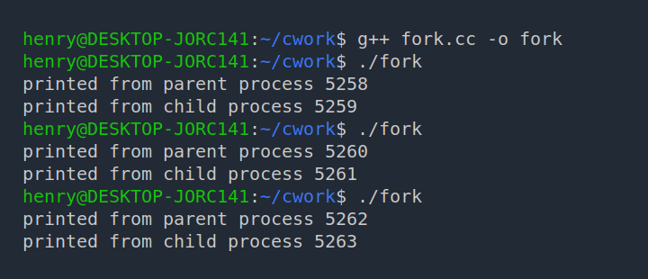
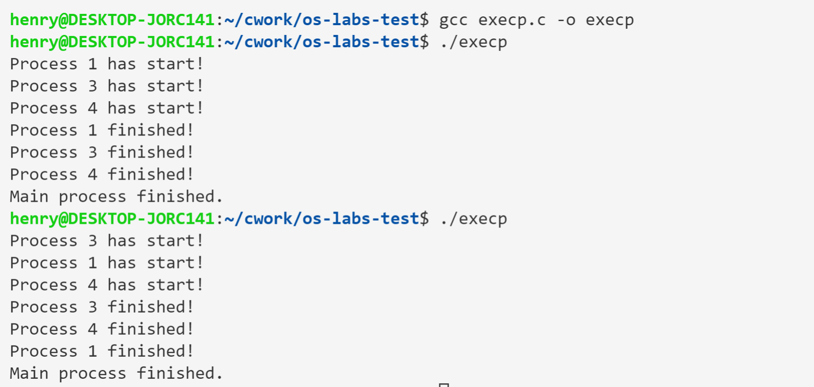
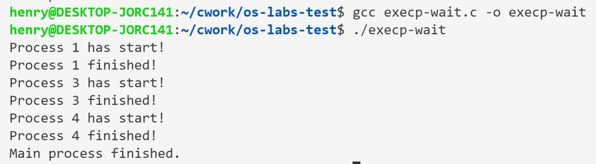

# 实验二：进程的初步认识

实验课时：3 学时

## 一、实验目的

1. 熟练使用系统调用：`fork`、`getpid`、`getppid`、`execvp`；
1. 设计程序，实现结果的不可再现性；使用同步原语，实现结果的可再现性；
1. 设计程序，使用递归及非递归方法对系统的进程数目进行压力测试，对运行时间进行监控。

<!-- 备注：使用同步原语，实现结果的可再现性：采用wait,semop。备注文字不写入实验报告 -->

## 二、实验原理

### 1. 简单的系统调用

#### fork()

`fork` 是符合 POSIX 要求的系统调用，在大多数类 Unix 系统上都可以使用。它可以用来创建新的进程，这个新的进程称作**子进程**（Child）。相对的，`fork` 的调用者（Caller）就称为父进程（Parent）。子进程是父进程的一份拷贝，也就是说，两个进程的数据段和代码段是相同的（但是不共享这些存储空间），当前执行的代码位置也是一样的，当子进程创建完成后，两个进程都会执行 `fork` 之后的代码。

通过 `fork` 调用，可以实现程序的并发运行，也可以运行文件系统中的其他可执行程序。

> 事实上，内核在进行进程的拷贝时，采用的是 Copy-On-Write 的方式，即只在发生写入时才真正进行数据的拷贝。
>
> - `fork()` 和 `CreateProcess()` 的区别：<https://stackoverflow.com/questions/13839935/forking-and-createprocess>
> - 为什么要通过 fork 来创建新的进程：<https://unix.stackexchange.com/questions/136637/why-do-we-need-to-fork-to-create-new-processes/136649#136649>

`fork()` 不接收参数，而在两个进程中均返回一个值：如果进程创建成功，则在父进程中返回子进程的 PID 值，在子进程中返回 0；否则，在父进程中返回 -1。

```cpp
pid_t fork(void);
```

示例程序 [fork-demo.cpp](./fork-demo.cpp)

```cpp
{{#include fork-demo.cpp}}
```

程序的输出类似如下：

```
printed from parent process 705
printed from child process 706
```



需要注意，程序每次执行的结果可能都会不一样，并不能保证子进程和父进程执行的先后顺序；此外，每次执行时进程的 PID 也不尽相同。

参考链接：

- <https://www.csl.mtu.edu/cs4411.ck/www/NOTES/process/fork/create.html>

#### wait()

调用了 `wait()` 的进程将一直被阻塞，直到其中一个子进程退出，或者接收到相应的信号。`wait()` 接收一个 `int` 类型变量的地址作为参数，而将返回完成了的子进程的参数。表示子进程的完成状态的标志将写入传入的 `int` 类型指针所指向的地址。

`wait()` 的执行有两种可能的情况：

- 如果调用 `wait()` 时，有至少一个子进程正在运行，则调用者将被阻塞直至某一子进程退出，之后，调用者继续执行后续代码。
- 如果调用 `wait()` 时没有子进程正在运行，则该次调用不产生影响。

考虑下面的程序：

[wait-demo.c](./wait-demo.c)

```cpp
{{#include wait-demo.c}}
```

程序中通过两次 `fork` 调用创建了两个子进程，因此需要两次 `wait` 以等待子进程执行完毕。

需要注意的是，由于两个进程并发执行，我们无从得知某个进程会先于另一个结束运行，因此等待某一个特定的进程完成任务可能会导致“忙等（busy-waiting）”的现象出现。

- <http://www.csl.mtu.edu/cs4411.ck/www/NOTES/process/fork/wait.html>

#### execvp()

创建出的子进程并不一定要和父进程执行相同的代码。诸 `exec` 系统调用即是用来使一进程得以运行任意的程序文件，包括二进制可执行程序或 shell 脚本。

`execvp()` 调用执行后，由第一个参数（`char *`）指定的程序文件，将被加载入调用者的地址空间，覆盖掉原有的程序代码；第二个参数指定的参数数组（`char **`）将被传递给该程序。

如果执行失败，`execvp()` 将返回一个负值。

我们可以实现一个简单的 shell 程序（或者说，一个能够根据用户从终端输入的字符串启动其他程序的程序）。

- <http://www.csl.mtu.edu/cs4411.ck/www/NOTES/process/fork/exec.html>

## 三、实验内容

### 1. 进程执行先后顺序的不可再现

简单的 C 程序，从 CLI 参数读入对应的参数（序号），对应的序号参数由父进程通过 `execvp` 调用时传入；程序会将调用时传入的序号输出。

```cpp
{{#include ./print.c}}
```

另一 C 程序，通过 fork 调用创建子进程，执行该程序。

```cpp
{{#include ./execp.c}}
```

结果图



可以看到两次执行的先后顺序不同。

### 2. 使用 wait 保证进程执行顺序

使用 wait 即可使进程按顺序执行。

```cpp
{{#include ./execp-wait.c}}
```




### 3. 测试进程最大数目
